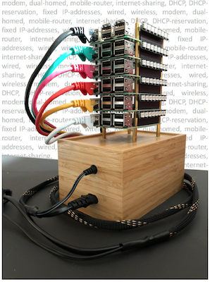
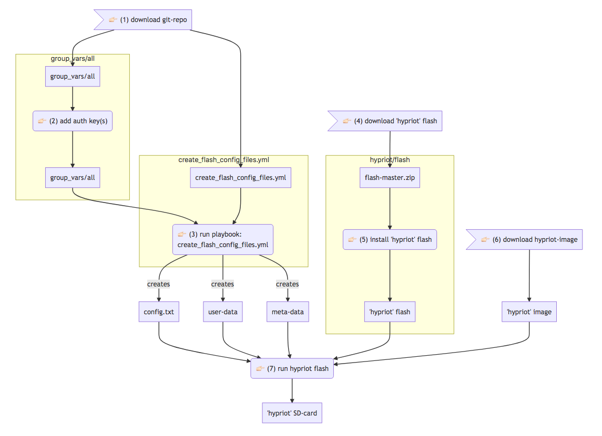
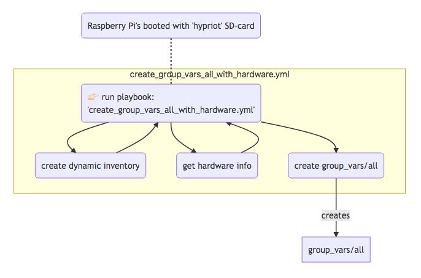
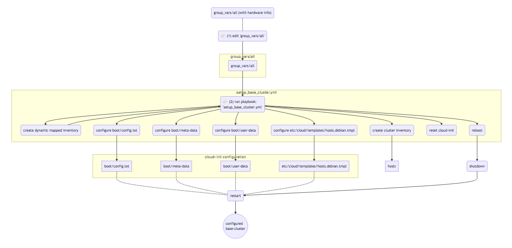
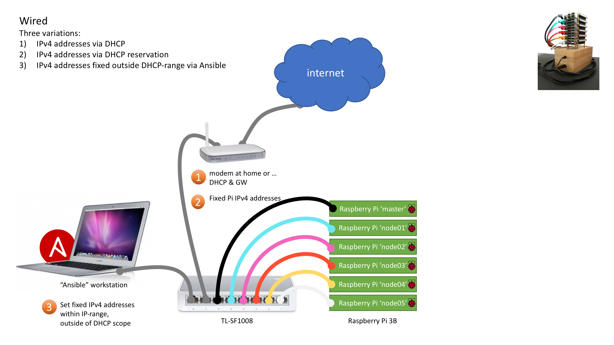
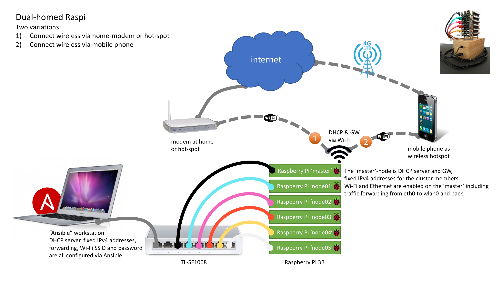
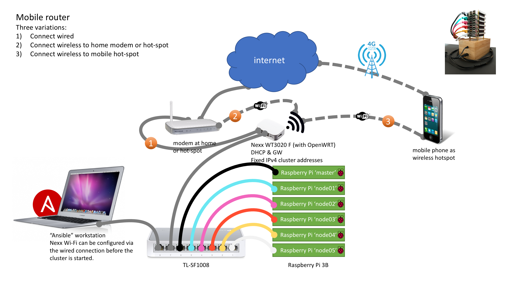
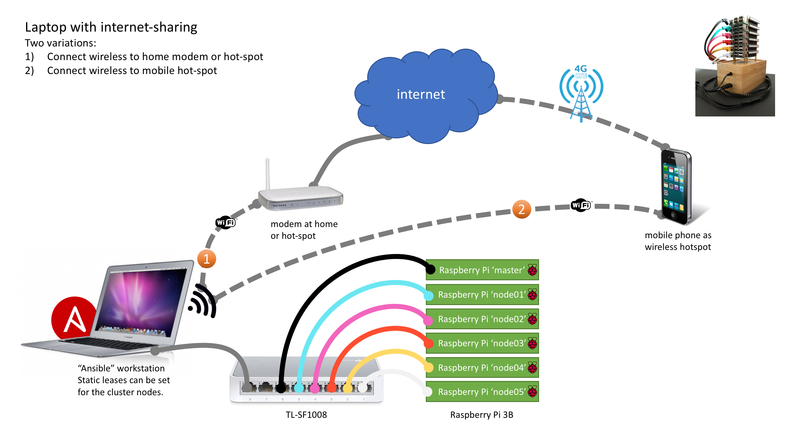

# Raspi Cluster automation with Ansible

The goal of this project is to create a basic Raspberry Pi cluster with minimal manual intervention.
If you want to create a Raspberry Pi cluster manually there are plenty of sites that tell you how in much detail. This project focusses on the automation part, the choices made along the way and the lessons learned.

Of course there are still manual steps but I tried to keep them to a bare minimum.

## Automation
I chose Ansible for several reasons. No server required to run, no agent required, runs from anywhere and because of my previous experiences with it. Tested with Ansible version 2.6.2.

## Base-image
The initial idea was to start with an SD-card with a basic Raspbian image. Default hostname, default user, insert the SD-card, connect the power and let the automation do the rest. Well it’s not that simple:

- SSH is disabled by default, 'touch /Volumes/boot/ssh' is required for each SD-card.
- Manual steps required to copy authorization keys (ssh-copy-id) to each device.

Manual steps, repeated for each device, definitely not a preferred scenario.

After reading a [blogpost](https://blog.hypriot.com/post/releasing-HypriotOS-1-8/) on using Hypriot and cloud-init I was convinced this was the way forward. By default the Hypriot image has:
- Docker installed,
- SSH enabled,
- Cloud-init enabled

With cloud-init you can add add authorization keys, a default user, set passwords or configure networking based on initial settings.

## Three steps

The whole setup from brand-new devices to a cluster-ready setup takes three ‘ansible’ steps:
- Create the SD-cards, configure the SD-card to automatically get access to the device.
- Detect the devices, detect the running devices, if you already know the MAC-addresss, you can skip this step and add these manually to `group_vars/all`.
- Setup the base-cluster, configure the devices for their cluster-roles.

## Create SD-cards

In this first step we prepare the SD-cards. Make sure to get a reliable SD-card with sufficient capacity.

1. Download this git-repo
2. Add your authorization key(s) to the file group_vars/all. There is a good ["how-to"](https://www.digitalocean.com/community/tutorials/how-to-set-up-ssh-keys--2) at Digital Ocean. This step gives the ansible-user password less access to the devices. You can configure multiple ssh-keys.
3. Run `ansible-playbook create_flash_config_files.yml` to create a config.txt, user-data and meta-data file. Settings from the group_vars/all are used in these files.
4. Download the flash tool from the [hypriot/flash ](https://github.com/hypriot/flash/archive/master.zip) git-repo.
5. Install the 'hypriot' flash tool according to the instructions on the [hypriot/flash ](https://github.com/hypriot/flash) page.
6. Download the latest hypriot image from [hypriot/image-builder-rpi/releases ](https://github.com/hypriot/image-builder-rpi/releases). For convenience save it to the directory 'flashdir'.
7. Run the following command from the directory 'flashdir' to create the SD-cards: `flash -C config.txt -u user-data -m meta-data hypriotos-rpi-v1.9.0.img.zip`.

## Detect the devices

In the second step we try to detect the Raspberry Pi's in the network.

The Mac-addresses of a Raspberry Pi all start with "b8:27:eb". With the command `arp -an | grep b8:27:eb` we can get a list of the running devices in the network.

Run the ansible playbook: `ansible-playbook create_group_vars_all_with_hardware.yml`. The found devices will be added to the file `group_vars/all`.
Running the playbook with all devices running gives you an unordered list of devices under 'mac_address_mapping'. The 'cattle'-way.

If you want to have more control over the order of the entries, turn on the devices one-by-one, run the playbook and make a note of the new entries under 'mac_address_mapping'. The 'pet'-way.
I have to confess I ordered the entries to match the physical stack.

For the functionality either way works.

## Setup the base-cluster

In the third step we configure the found devices in the file `group_vars/all`.

The following items can be configured in `group_vars/all`:
- enable static IPv4 address (default disabled)
- set IPv4 address
- enable Wi-Fi, do not forget to add SSID and PSK in the 'wifi_networks' section (disabled by default)
- host name
- cluster role; node or master (default role is node)
- gateway and domain name servers (only used with static IPv4 addresses)

1. Edit the file `group_vars/all` and make the required changes.
2. Run `ansible-playbook setup_the_base_cluster.yml`

The new configuration is placed on the SD-cards and the devices will be rebooted. If you need to change the setup, make the required changes to `group_vars/all` (step 1) and run the playbook again (step 2).

## Networking

The base-cluster uses DHCP by default but can easily be reconfigured by changing the 'group_vars/all' file and running the last playbook again.
What configuration you want is determined by what you want to run and where. If you want to run Kubernetes on your cluster, setting fixed IP-addresses is a requirement. If you want to use your Raspi-cluster as a demo environment at home, at work and on the road you want it to be more flexible.

Based on how the gateway is connected I see four network options where each has different variations.

### Wired
Very convenient setup when you use the cluster at home.

### Dual-homed Raspi
In this setup, Wi-Fi is enabled on the master-node and forwarding is set from eth0 to wlan0 and back.
A bonus playbook is added to set this up (setup_dhcp_and_forwarding.yml). Don't forget to check the file 'roles/add_dhcp_server/templates/dhcpd.conf.j2' for the right DHCP settings.

Configuring the SSID and password is done via 'group_vars/all' and running the ansible-playbook again.
You can configure multiple Wi-Fi networks. For example:
- Wi-Fi at home
- Wi-Fi at work
- Wi-Fi hotspot on your mobile phone

### Mobile router
With an upgraded (OpenWRT) mobile router like the [Nexx WT3020](https://openwrt.org/toh/nexx/wt3020) you use the router as gateway to the outside world. Changes to Wi-Fi or fixed IP-addresses have to be configured on the router.

### Laptop with internet-sharing
Most laptops can be used for internet-sharing. The laptop serves as gateway and DHCP server. Setting fixed IP-addresses is a challenge. You need to modify the file '/Library/Preferences/SystemConfiguration/com.apple.nat' but I haven't found a proper "HowTo" yet.

